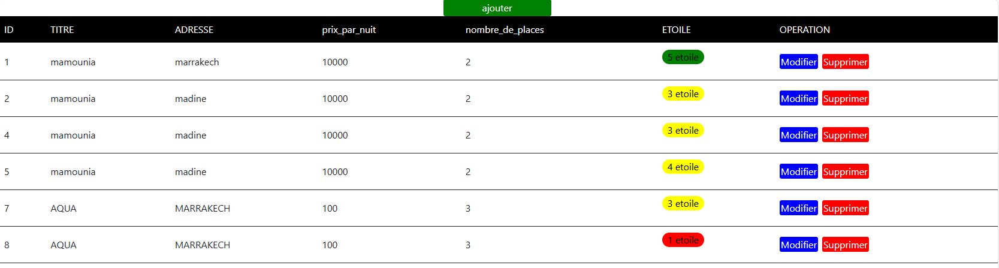

# Hotel-Management-System
The Hotel Management System is a web-based application designed to manage hotel information efficiently. It provides functionalities to add, update, delete, and display hotel records stored in a MySQL database. The system leverages PHP for server-side scripting and Bootstrap for responsive design, ensuring a user-friendly interface.

### File Name: `index.php`

### Description:
This PHP script is a dynamic web page designed to display hotel information retrieved from a MySQL database. The page uses Bootstrap for styling and custom CSS for additional enhancements. It allows users to view, add, update, and delete hotel records.

#### Key Features:
1. **Database Connection**: Establishes a connection to a MySQL database using PDO.
2. **Data Retrieval**: Fetches all records from the `hotel` table and displays them in an HTML table.
3. **Add Hotel**: Provides a link to a form for adding new hotel records (`add.php`).
4. **Update Hotel**: Each record includes a link to update the hotel information (`update.php?id={id}`).
5. **Delete Hotel**: Each record includes a link to delete the hotel (`delete.php?id={id}`).
6. **Styling**: Uses Bootstrap for responsive design and custom CSS for table hover effects and button styles.
7. **Star Ratings**: Displays hotel ratings with different colors based on the number of stars.

### File Name: `add.php`

### Description:
This PHP script provides a form for adding new hotel records to the database. Upon form submission, the data is inserted into the `hotel` table.

#### Key Features:
1. **Form Input**: Includes fields for the hotel title, address, price per night, number of places, and star rating.
2. **Form Submission**: Handles form submission using the POST method and inserts the data into the `hotel` table.
3. **Redirection**: Redirects back to `index.php` after successfully adding a new record.

### File Name: `update.php`

### Description:
This PHP script provides a form for updating existing hotel records. It pre-fills the form with the current data of the selected hotel and updates the record upon form submission.

#### Key Features:
1. **Data Pre-fill**: Retrieves the current data of the selected hotel and populates the form fields.
2. **Form Input**: Includes fields for the hotel title, address, price per night, number of places, and star rating.
3. **Form Submission**: Handles form submission using the POST method and updates the corresponding record in the `hotel` table.
4. **Redirection**: Redirects back to `index.php` after successfully updating the record.

### File Name: `delete.php`

### Description:
This PHP script deletes a specified hotel record from the database based on the provided hotel ID.

#### Key Features:
1. **Record Deletion**: Deletes the hotel record with the specified ID from the `hotel` table.
2. **Redirection**: Redirects back to `index.php` after successfully deleting the record.
